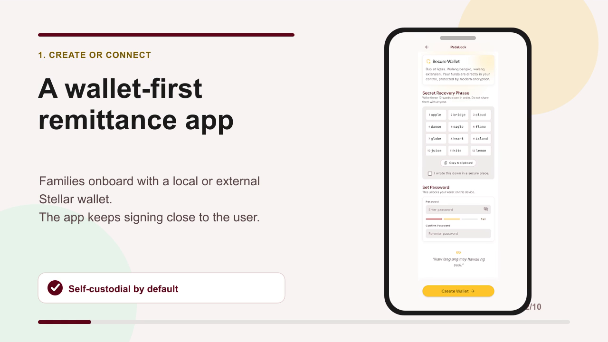
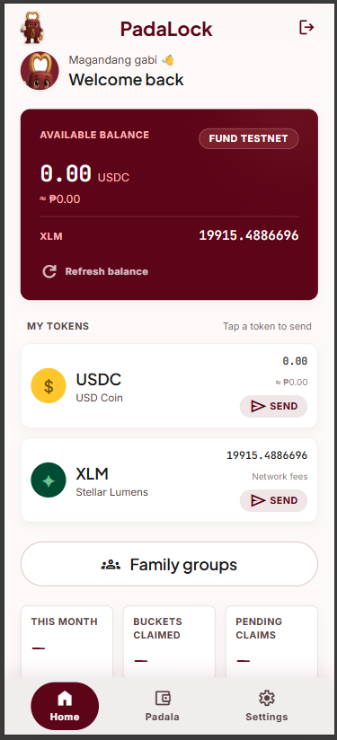
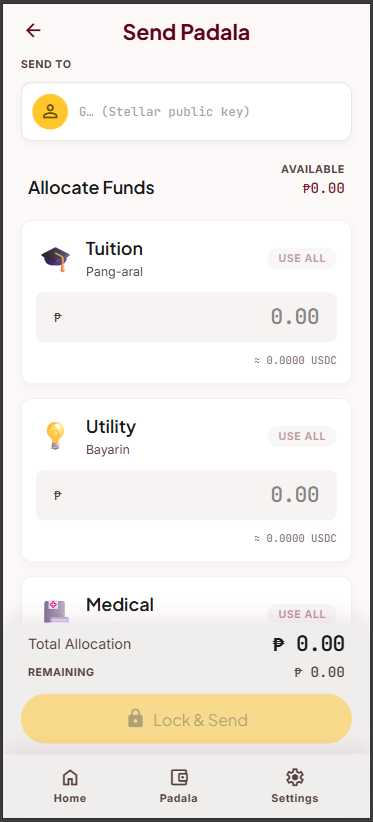
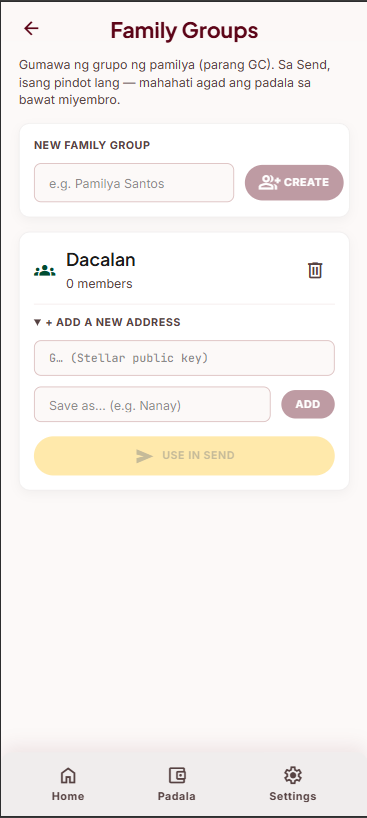
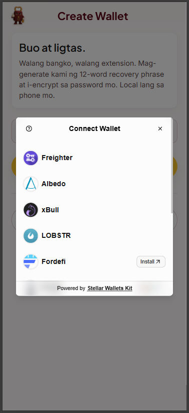
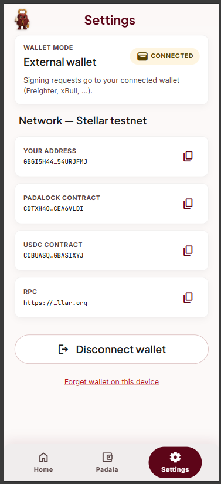
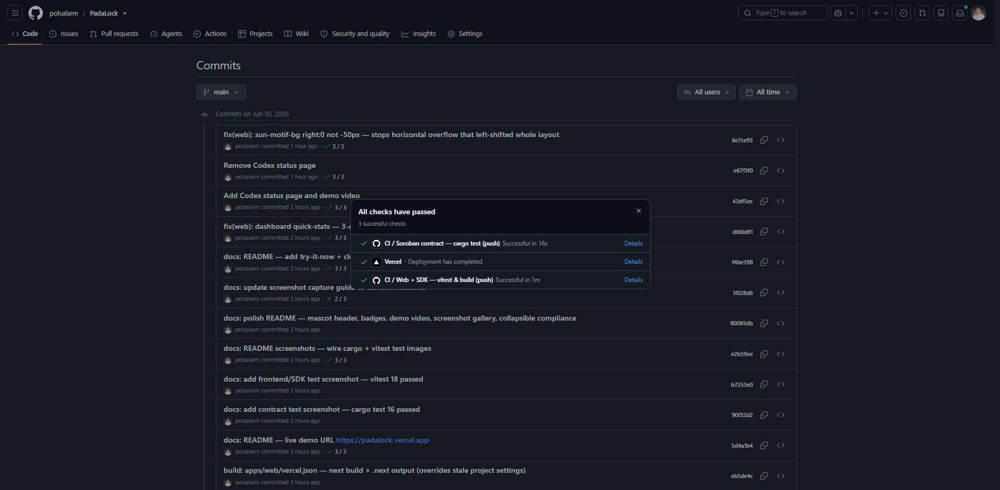
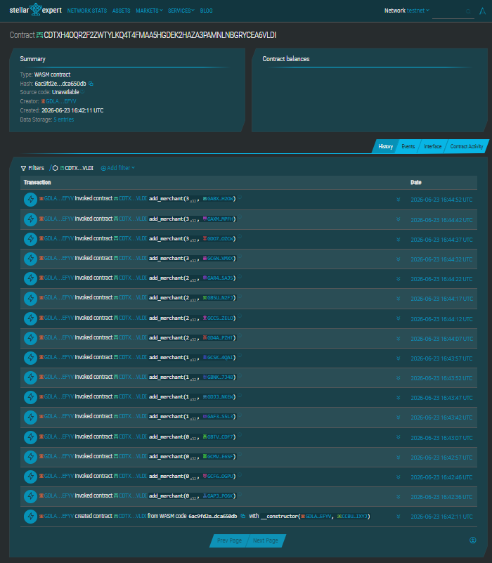
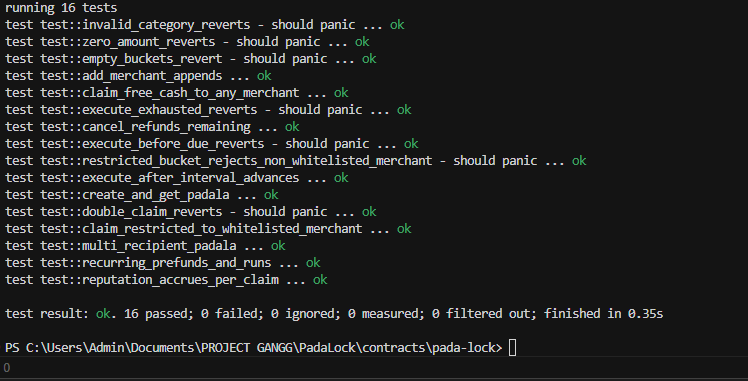
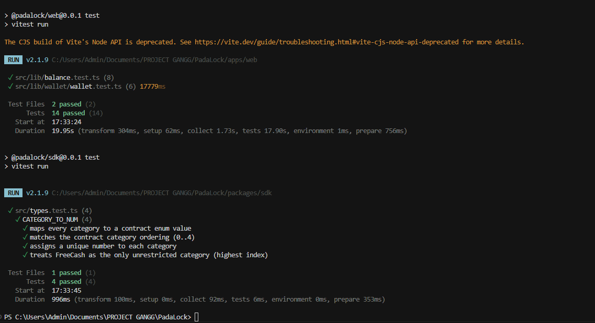

<div align="center">


# PadaLock

### Purpose-Locked OFW Remittance on Stellar

*Padala na may pangako — send money home that can only be spent the way it was meant to.*

[](https://github.com/polsalarm/PadaLock/actions/workflows/ci.yml)
&nbsp;
&nbsp;
&nbsp;
&nbsp;

**[🚀 Live demo](https://padalock.vercel.app)** · **[🎬 Demo video](./docs/demo-video/padalock-demo.mp4)** · **[🔎 Contract on Stellar Expert](https://stellar.expert/explorer/testnet/contract/CDTXH4OQR2F2ZWTYLKQ4T4FMAA5HGDEK2HAZA3PAMNLNBGRYCEA6VLDI)**

<sub>StellarX Philippines · Track 1 — Remittance & Cross-Border · Risein Orange Belt (Level 3)</sub>

</div>

---

## 📌 At a glance

| | |
|---|---|
| **Live demo** | https://padalock.vercel.app |
| **Demo video** | [`docs/demo-video/padalock-demo.mp4`](./docs/demo-video/padalock-demo.mp4) |
| **Network** | Stellar **testnet** |
| **Contract address** | [`CDTXH4OQ…RYCEA6VLDI`](https://stellar.expert/explorer/testnet/contract/CDTXH4OQR2F2ZWTYLKQ4T4FMAA5HGDEK2HAZA3PAMNLNBGRYCEA6VLDI) |
| **Sample interaction tx** | [`8214e348…158d4f4`](https://stellar.expert/explorer/testnet/tx/8214e34844f89515fd08ef2db494f45c3cfb5e11134b7441ecf722fcc158d4f4) · more in [`docs/testnet-state.md`](./docs/testnet-state.md) |

<div align="center">

### 👉 Try it now — no install, no extension needed

**[▶︎ Open the live app](https://padalock.vercel.app)** &nbsp;·&nbsp; create a wallet &nbsp;·&nbsp; fund with one tap &nbsp;·&nbsp; send a purpose-locked padala in under a minute.

*Runs on Stellar testnet — play with real on-chain money, zero risk.*

</div>

---

## 📖 Contents

[What is PadaLock?](#-what-is-padalock) ·
[Demo](#-demo) ·
[Screenshots](#️-screenshots) ·
[How it works](#-how-it-works) ·
[Features](#-features) ·
[Repo layout](#️-repo-layout) ·
[Tech stack](#️-tech-stack) ·
[Quick start](#-quick-start) ·
[Testing & CI](#-testing--ci) ·
[Deployment](#️-deployment) ·
[Routes](#-routes) ·
[Compliance](#-risein-compliance) ·
[Roadmap](#️-mainnet-roadmap)

---

## 💡 What is PadaLock?

Filipino OFWs send **~$36B/yr** home. The recurring pain: the sender has **no control** over how the money is spent — a lump sum vanishes in days, tuition goes unpaid, the electricity gets cut.

**PadaLock** lets the sender split a remittance into **purpose buckets** at send time. Restricted buckets are escrowed in a Soroban contract and can **only** be released to whitelisted merchants; free cash off-ramps to PHP through a real SEP-24 anchor. The sender sees an on-chain receipt of every release.

| Bucket | Releases to |
|---|---|
| 🎓 Tuition | whitelisted school accounts |
| 💡 Utility | whitelisted biller proxies |
| 🏥 Medical | whitelisted clinic / pharmacy accounts |
| 🛒 Groceries | whitelisted supermarket aggregators |
| 💵 Free cash | unrestricted → PHP off-ramp (SEP-24) |

---

## 🎬 Demo

<div align="center">

[](./docs/demo-video/padalock-demo.mp4)

▶︎ **[Watch the 1–2 min demo](./docs/demo-video/padalock-demo.mp4)**

</div>

---

## 🖼️ Screenshots

### 📱 Mobile-first UI

<div align="center">

| Dashboard | Send / split | Claim |
|:---:|:---:|:---:|
|  |  |  |
| **Family groups** | **Connect wallet** | **Settings** |
|  |  |  |

</div>

### ⚙️ CI/CD · 🔗 on-chain proof

| CI/CD — all checks passing | Contract & tx history (Stellar Expert) |
|:---:|:---:|
|  |  |

### ✅ Tests

| Contract — `cargo test` · 16 passed | Frontend + SDK — `vitest` · 18 passed |
|:---:|:---:|
|  |  |

---

## 🔄 How it works

```
   OFW (abroad)                         Family (PH)
        │                                    │
        │  split USDC into buckets           │  claim per bucket
        ▼                                    ▼
 ┌──────────────┐                     ┌──────────────┐
 │  Sender PWA  │                     │ Receiver PWA │
 └──────┬───────┘                     └──────┬───────┘
        │ simulate · sign · poll             │ claim tx
        ▼                                    ▼
 ┌───────────────────────────────────────────────────────┐
 │             Stellar testnet · Soroban RPC v14           │
 │                                                         │
 │   PadaLock contract                                     │
 │     • create_padala(buckets, recipients)                │
 │     • claim(padala_id, bucket_id, merchant)             │
 │     • create_recurring / execute_due / cancel_recurring │
 │     • get_reputation(merchant)                          │
 │                                                         │
 │   cross-contract → USDC SAC (transfer / balance)        │
 │   restricted buckets → whitelisted merchants only       │
 │   free cash → SEP-24 anchor → PHP off-ramp              │
 └───────────────────────────────────────────────────────┘
```

---

## ✨ Features

- **🔒 Purpose-locked buckets** — restricted buckets release only to whitelisted merchants; free cash is unrestricted.
- **👨‍👩‍👧 Multi-recipient padala** — each bucket names its own recipient, so one padala fans out to several family members; each claims only their own buckets.
- **🔁 Recurring padala** — sender prefunds N runs up front; `execute_due` is permissionless and mints a fresh padala each interval; cancel refunds the unspent prefund.
- **💱 Real SEP-24 off-ramp** — free cash is claimed to the recipient's wallet, then cashed out via genuine SEP-10 auth + SEP-24 interactive withdraw against `testanchor.stellar.org`.
- **⭐ On-chain merchant reputation** — per-merchant claim count / volume accrued on every claim, surfaced in the claim picker.
- **🔗 Deep-link + QR claim share** — send-success shows a shareable claim link, QR, and native Share sheet for low-tech family.
- **👛 Hybrid wallet** — built-in self-custodial wallet (BIP-39 + Argon2 + AES-GCM) **or** external via Stellar Wallets Kit (Freighter, xBull, Albedo, Lobstr, Ledger).

---

## 🗂️ Repo layout

```
contracts/pada-lock/   Soroban contract (Rust)
apps/web/              Next.js 16 self-custodial PWA (sender + receiver)
packages/sdk/          shared TypeScript SDK (RPC, tx builders, polling)
docs/                  deploy guide, demo script, testnet state, screenshots
plan.md                phased build plan
```

---

## 🧰 Tech stack

- **Stellar** testnet · `@stellar/stellar-sdk` v14 (`rpc` namespace)
- **Soroban** Rust SDK (`soroban-sdk` 25)
- **Next.js 16** App Router · React 19 · Tailwind · PWA, mobile-first
- **Self-custodial wallet** — BIP-39 mnemonic → Argon2id → AES-GCM
- **npm workspaces** monorepo · typed SDK boundary · simulate-before-sign · finality polling

---

## 🚀 Quick start

```bash
npm install
npm run contract:build      # build the Soroban contract
npm run contract:test       # 16 cargo tests
npm run dev                 # http://localhost:3000
```

To run against a fresh deploy: copy `.env.example` → `apps/web/.env.local`, fill the
contract IDs, then follow [`docs/demo-script.md`](./docs/demo-script.md).

---

## ✅ Testing & CI

```bash
npm run contract:test                  # 16 Soroban unit tests (cargo)
npm test                               # SDK + web Vitest (18)
cd packages/sdk && npx vitest run      # SDK only (4)
```

> **16 contract + 18 frontend/SDK = 34 passing.**

Every push and PR to `main` runs [`.github/workflows/ci.yml`](./.github/workflows/ci.yml) —
two parallel jobs: **contract** (`cargo test`) and **web** (Vitest across workspaces +
`next build`). Status badge is at the top of this README.

---

## ☁️ Deployment

- **Contract** → [`docs/deploy.md`](./docs/deploy.md); live IDs in [`docs/testnet-state.md`](./docs/testnet-state.md).
- **Frontend (Vercel)** → npm-workspace monorepo. Set the project **Root Directory to `apps/web`**
  (Settings → Build & Deployment); Vercel auto-detects Next.js and installs from the monorepo root.
  [`.vercelignore`](./.vercelignore) keeps the upload small (excludes `target/`, `node_modules`, `.next`).

  | Env var | Value (testnet) |
  |---|---|
  | `NEXT_PUBLIC_PADALOCK_CONTRACT_ID` | `CDTXH4OQR2F2ZWTYLKQ4T4FMAA5HGDEK2HAZA3PAMNLNBGRYCEA6VLDI` |
  | `NEXT_PUBLIC_USDC_SAC_TESTNET` | `CCBUASQQH2CSNCMQCLW5I25LXO2V7DQQTIKZ34YGTBGTDU3JGBASIXYJ` |
  | `NEXT_PUBLIC_USDC_ISSUER_TESTNET` | `GAZ5YSMH4Z2VXLLVR7FE7RENVBSDLU5U4PCJZYHRFZSBANA765TZEUQE` |
  | `NEXT_PUBLIC_SEP24_ANCHOR_DOMAIN` | `testanchor.stellar.org` |

---

## 🧭 Routes

| Route | Purpose |
|---|---|
| `/onboard` | Create self-custodial wallet (mnemonic + password) |
| `/login` | Unlock |
| `/dashboard` | USDC balance, friendbot, nav |
| `/send` | OFW splits padala across buckets |
| `/claim/[id]` | Family member claims per bucket |
| `/padala/[id]` | Sender transparency: who claimed what, when |

---

## 🏅 Risein compliance

<details>
<summary><strong>Orange Belt (Level 3) — Advanced contracts + production-ready dApp</strong></summary>

| Requirement | Where in PadaLock |
|---|---|
| Advanced smart contract | `create_padala` / `claim` / `create_recurring` / `execute_due` / `cancel_recurring` / `get_reputation` — escrow, multi-recipient, recurring, on-chain reputation. |
| Inter-contract communication | Cross-contract calls to the **USDC SAC** (`transfer` / `balance`) to move escrowed funds to merchants. |
| Event streaming & real-time updates | Contract emits an event per bucket on create/claim; SDK reads via RPC `getEvents` (`packages/sdk/src/read.ts`); `/padala/[id]` renders the live claim ledger. |
| CI/CD pipeline | [`.github/workflows/ci.yml`](./.github/workflows/ci.yml) — `cargo test` + Vitest + `next build` on every push/PR. |
| Contract deployment workflow | [`docs/deploy.md`](./docs/deploy.md) — build, deploy, seed merchants, capture IDs. |
| Mobile responsive frontend | Mobile-first PWA (Tailwind), bottom nav, install prompt. |
| Error handling & loading states | Simulation guards, `pollFinality` (never trusts `sendTransaction`), pending spinners, success/error badges. |
| Tests (contract + frontend) | 16 `cargo test` + 18 Vitest = **34 passing**. |
| Production architecture | npm-workspace monorepo, typed SDK boundary, env-driven config, simulate-before-sign, finality polling. |
| Documentation & demo | This README + [`docs/`](./docs) + demo video. |

</details>

<details>
<summary><strong>White Belt (Level 1) — Wallet + payments</strong></summary>

| Requirement | Where in PadaLock |
|---|---|
| Wallet setup (testnet) | Hybrid — Stellar Wallets Kit (Freighter/xBull/Albedo/Lobstr) or built-in self-custodial. `Networks.TESTNET`. |
| Wallet connect | `/onboard` & `/login` → **Connect external wallet**; built-in create/unlock too. |
| Wallet disconnect | `/settings` → **Disconnect / Lock wallet**. |
| Fetch + display XLM balance | Dashboard hero card (Horizon) — `getXlmBalance()` in `apps/web/src/lib/balance.ts`. |
| Send XLM on testnet | `/send-xlm` — builds a classic `payment`, signs, submits to RPC. |
| Transaction feedback | `/send-xlm` shows success/fail badge, tx hash, Stellar Expert link. |

</details>

---

## 🛣️ Mainnet roadmap

- Partner with a PH anchor (Coins.ph / Anclap PHP) for a real off-ramp
- KYC-light onboarding via SEP-12 for senders abroad
- Merchant whitelist governance — schools via DepEd, utilities via biller APIs
- SEP-31 cross-border send from non-USDC corridors (USD/SGD/AED)

---

<div align="center">

## Ready to see it?

**[🚀 Launch the live demo](https://padalock.vercel.app)** &nbsp;|&nbsp; **[🎬 Watch the video](./docs/demo-video/padalock-demo.mp4)** &nbsp;|&nbsp; **[⭐ Star the repo](https://github.com/polsalarm/PadaLock)**

<br>

<sub>Built for the Filipino diaspora — <em>filipinos helping filipinos protect what they send home.</em></sub>

</div>
